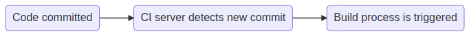
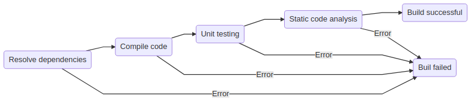

##  Continuous Integration

### Workflow

- Code is committed to VCS
- CI server monitors VCS 
  - Able to detect new commits 
  - Triggers build process

### Build process

- Resolving required dependencies
- Compiling source code
- Executing unit tests
- Executing static code analysis

If one of the **quality gates** is not passed, the build fails.
