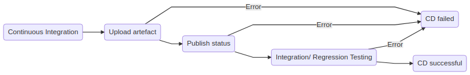

## Continuous Delivery

### Prerequisite
- Successful execution of continuous integration process

### Workflow
- Upload the build artefact to a repository
- Publish the build status

### Workflow
- Steps executed after everything went well
  - Integration/ Regression Testing 
  - Deploy to a production-like environment aka *staging*

If one of the quality gates is not passed, the build fails.
